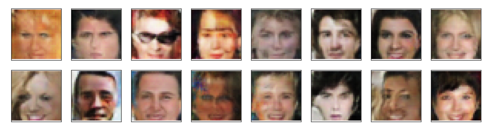

# Face Generation Project
This Project is the 4th project of the [Udacity Deep Learning Nanodegree](https://www.udacity.com/course/deep-learning-nanodegree--nd101) 
The goal was to create a generate new images of faces by defining and training a Deep Convolutional Generative Adversarial Network(DCGAN) AI model.

<!--  -->

## Table of Contents

* [Load the Notebook](#load-the-notebook)
* [Dependencies](#dependencies)
* [Meta](#meta)
* [Contributing](#contributing)

## Load the Notebook

* [Clone via Github](https://github.com/EliShayGH/face-generation-project.git)
* [Download a zip file](https://github.com/EliShayGH/face-generation-project/archive/master.zip)

## Dependencies:

* [Anaconda Python 3](https://www.anaconda.com/)
* Python libraries: PyTorch, numpy, pandas, matplotlib
* [Jupyter Notebook](https://jupyter.org/)

## Meta

Eli Shay – El_mn123@hotmail.com

[https://github.com/EliShayGH/tv-script-generation](https://github.com/EliShayGH/face-generation-project)

## Contributing

1. Fork it (<https://github.com/EliShayGH/face-generation-project/fork>)
2. Create your feature branch (`git checkout -b feature/fooBar`)
3. Commit your changes (`git commit -am 'Add some fooBar'`)
4. Push to the branch (`git push origin feature/fooBar`)
5. Create a new Pull Request
